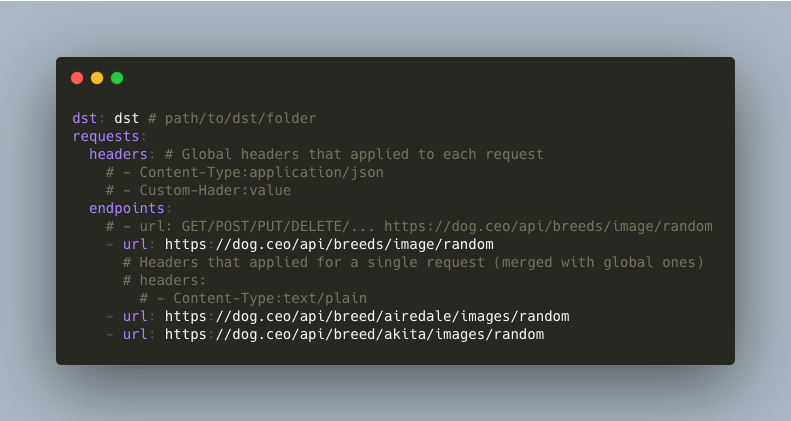

### [🚧 WIP 👷‍♀️⛏👷🔧️👷🔧 🚧 ]

# Da heck is dis?
Small command-line thing to make HTTP requests from and store responses as a file tree.

# Why?
This can be useful for writing automated ui tests
to avoid interacting with real server and to avoid manually creating 
response files to start tests.

### Example config:
```config.json```
```json
{
  "dst": "path/to/destination/root",
  "requests": {
    "headers": {},
    "endpoints": [
      {
        "url": "https://dog.ceo/api/breeds/image/random",
        "headers": {}
      },
      {
        "url": "https://dog.ceo/api/breed/Affenpinscher/images/random"
      },
      {
        "url": "https://dog.ceo/api/breed/African/images/random"
      }
    ]
  }
}
```

### Will result in:


### Usage:
`./data_fetcher path/to/config.json [FLAGS`

### Flags:
- `-- verbose`: enable logging

### Config overview:
- `dst`[required] - Destination root where responses tree will start from
- `requests`[required] - An object that contain info about the requests
  - `headers`[optional] - optional map of headers that will be attached to each request
  - `endpoints`[required] - array of actual request objects
    - Example of endpoint object:
    - `url`[required] - url of http request
    - `headers`[optional] - headers of particular request (will be merged with parent headers if present)
    
### TODO:
 - More accurate error handling
 - Parallel execution
 - Don't execute requests if response are present
 - Different request types (POST, DELETE, etc...)
 - `--force` flag to re-execute all requests
 - ~~- Logging (`--verbose`) flag~~
 - Appending query parameters to requests
