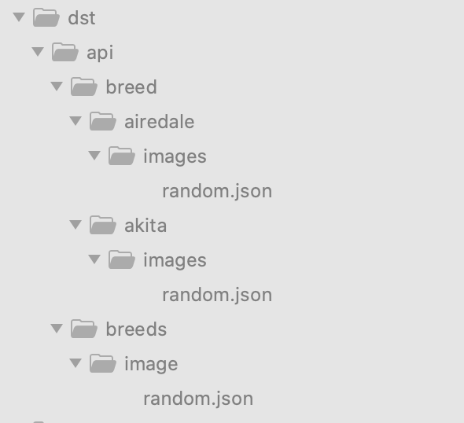

### [🚧 WIP 👷‍♀️⛏👷🔧️👷🔧 🚧 ]

# Da heck is dis?
Small command-line thing to make HTTP requests and store responses as a file tree.

# Why?
This can be useful for writing automated ui tests
to avoid interacting with real server and to avoid manually creating 
response files to start tests.

### Example config:

### Will result in:

### Usage:
`./data_fetcher path/to/config.json [FLAGS]`

### Flags:
- `--verbose`: enable logging
- `--force`: re-download all requests (by default, if the response is present, the request will be skipped)

### Config overview:
- `dst`[required] - Destination root where responses tree will start from
- `requests`[required] - An object that contain info about the requests
  - `headers`[optional] - optional map of headers that will be attached to each request
  - `endpoints`[required] - array of actual request objects
    - Example of endpoint object:
    - `url`[required] - url of http request
    - `headers`[optional] - headers of particular request (will be merged with parent headers if present)
    
### TODO:
 - Parallel execution
 - Different request types (POST, DELETE, etc...)
 - Appending query parameters to requests
